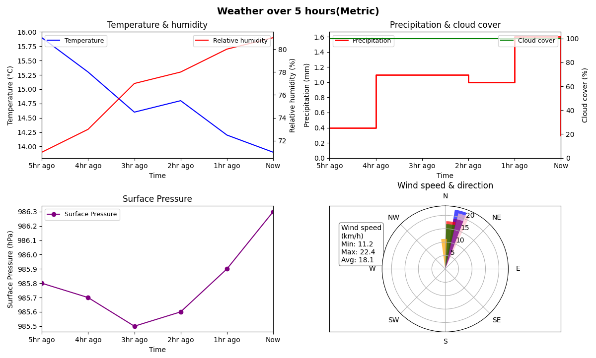

# Weather Analyzer

This program fetches weather data from [Open-Meteo](https://open-meteo.com/) and plots them. It can plot today's weather, archived weather data from the past 5 hours, 4 days, 1 month, 2 months and 3 months, as well as forecast data for the next 3 days. It plots temperature, humidity, precipitation, cloud cover, surface pressure, wind speed, and wind direction.

The program can plot in both Metric and Imperial units.



## Installation

1. Clone the repository   
2. `cd weather_project`
3. Create the virtual environment:
```
python3 -m venv venv
```

4. Activate the virtual environment:

**macOS / Linux**
```
source venv/bin/activate
```

**Windows (PowerShell)**
```
.\venv\Scripts\Activate.ps1
```

**Windows (Command Prompt / cmd)**
```
.\venv\Scripts\activate.bat
```

1. Install dependencies
```
pip install -r requirements.txt
```

## Running the program
1. Run `visuals.py`
2. Enter the city and country names
3. Enter the duration
4. Enter the units