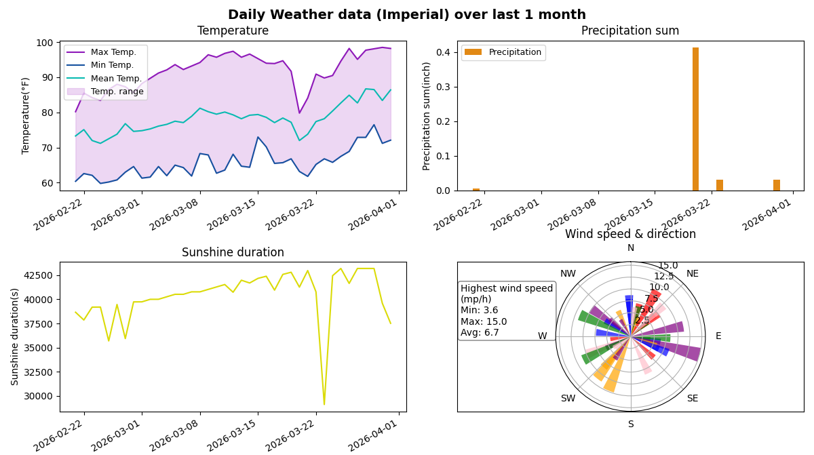

# Weather Analyzer

## Description
This program fetches weather data from [Open-Meteo](https://open-meteo.com/) and plots them. It can plot today's weather, archived weather data from the past 5 hours, 4 days, 1 month, 2 months and 3 months, as well as forecast data for the next 3 days. The program can plot in both Metric and Imperial units.

The Open-Meteo API [fetches different parameters for hourly and daily weather data](https://open-meteo.com/en/docs), and our program follows the same convention. The parameters plotted for hourly and daily weather data are slightly different.

Hourly data parameters include:
- Temperature
- Humidity
- Precipitation
- Cloud cover
- Surface pressure
- Wind speed and direction

Daily data parameters include:
- Temperature (max, min and mean over time)
- Precipitation sum
- Sunshine duration
- Wind speed and direction

## Installation

1. Clone the repository   
2. `cd weather_project`
3. Create the virtual environment:
```
python3 -m venv venv
```

4. Activate the virtual environment:

- **macOS / Linux**
```
source venv/bin/activate
```

- **Windows (PowerShell)**
```
.\venv\Scripts\Activate.ps1
```

- **Windows (Command Prompt / cmd)**
```
.\venv\Scripts\activate.bat
```

5. Install dependencies
```
pip install -r requirements.txt
```

## Running the program
1. Run `weather_main.py`
2. Enter the city and country names
3. Enter the duration
4. Enter the units

## Examples

### Hourly data

Weather in Athens, Greece in the last 5 hours in Metric units:


### Daily data

Weather in Kota, India in the last month in Imperial units:


